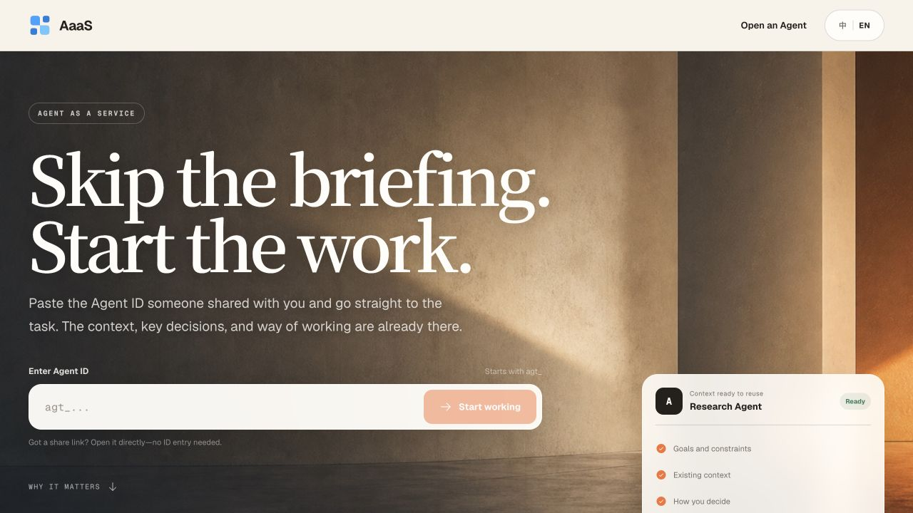
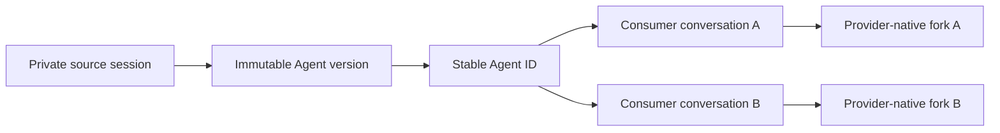

<div align="center">

# AaaS — Agent as a Service

**Turn a working session into an Agent anyone can use.**

Publish a Codex or Claude Code session once. Teammates, clients, or their own
Agents can continue from what it already learned—without seeing or changing
your original conversation.

[](https://github.com/Equality-Machine/agent-as-a-service/actions/workflows/ci.yml)
[](LICENSE)
[](package.json)
[](https://aaas-agent-service.b4yesc4t.chatgpt.site)

[Try the web app](https://aaas-agent-service.b4yesc4t.chatgpt.site)
·
[Installation](docs/INSTALL.md)
·
[Architecture](docs/ARCHITECTURE.md)
·
[Contributing](CONTRIBUTING.md)
·
[中文](README.zh-CN.md)

</div>



## Why AaaS

The hard part of a useful Agent is rarely the first prompt. It is the context
earned over dozens of turns: what matters, what has been tried, what good looks
like, and how the work gets done. AaaS makes that head start reusable.

| Start with context | Share anywhere | Keep conversations private |
| --- | --- | --- |
| Publish what a Codex or Claude Code session has already learned. | Give someone a link or Agent ID for the web, Codex, Claude Code, MCP, or HTTP. | Every use starts an independent conversation. Consumer messages never write back to the publisher's source session. |

## A different starting point

AaaS is not another prompt builder. It starts from a session where the work has
already happened and turns that accumulated understanding into a reusable entry
point.

| What you share | What the next person receives |
| --- | --- |
| Prompt or Agent configuration | Instructions for a new conversation |
| Shared chat | A readable snapshot of the past |
| Workflow export | A definition to import and reconnect |
| **AaaS Agent** | **A private continuation of proven working context** |

## One link, one head start

1. A researcher spends a long Codex session testing assumptions and refining a
   method.
2. They publish it as a **Market Research Agent** and share the link.
3. A product lead opens it and asks the actual next question:

   > Turn the evidence into a launch brief for enterprise buyers.

4. The product lead gets a private, continuous conversation. The researcher's
   original session stays unchanged.

The same pattern works for project handoffs, reusable coding and research
partners, and customer-facing experts: preserve the hard-won understanding,
then let the next person start with the outcome.

## Quick start

### Use a shared Agent

The fastest path needs no installation:

1. Open the [web app](https://aaas-agent-service.b4yesc4t.chatgpt.site).
2. Paste an Agent ID such as `agt_...`, or open a shared Agent link.
3. Start working.

To use shared Agents inside Codex or Claude Code:

```bash
npx -y Equality-Machine/agent-as-a-service
```

This installs the AaaS Skill and MCP integration. It does **not** install a
Runner or start a background service. Consumers do not need one.

After restarting the client, ask naturally:

```text
Use Agent agt_... and ask it to turn this idea into a three-step plan.
```

### Publish your own Agent

If this machine will publish sessions, install the publisher role:

```bash
npx -y Equality-Machine/agent-as-a-service publisher
```

Then, from the Codex or Claude Code session you want to share:

```text
Publish this conversation as an Agent named "Research Partner".
Run it on my local machine.
```

A local publisher uses a persistent Runner on the publisher's machine. The
Skill explains that system change and asks for confirmation before installing
it. Publishing returns an Agent ID and a shareable link.

See [Installation and roles](docs/INSTALL.md) for the curl fallback, server
Runner setup, supported overrides, and manual configuration.

## How it works



- The **source session** stays private on the publisher or paired Runner.
- An **Agent version** freezes a completed point in that session.
- The **Agent ID** is the stable identity people share.
- Every **conversation** receives its own provider-native fork and can continue
  independently.

Local mode keeps source material and provider login on the publisher's machine.
Cloud mode transfers an authenticated, AES-256-GCM encrypted source capsule to
a paired server Runner. In both modes, the control plane coordinates public
metadata, conversations, messages, and job leases.

Read the [architecture guide](docs/ARCHITECTURE.md) for the object model,
Runner topology, isolation boundary, job lifecycle, and current trust model.

## Interfaces

| Interface | Best for |
| --- | --- |
| [Web](https://aaas-agent-service.b4yesc4t.chatgpt.site) | Using an Agent from any browser |
| Skill + MCP | Natural use and publishing from Codex or Claude Code |
| HTTP API | Product integrations and automation |
| Local Runner | Agents that depend on private files, local repos, or desktop credentials |
| Cloud Runner | Always-on execution on a controlled server |

The MCP surface includes:

```text
runner_status
install_local_runner
publish_current_agent
find_agent
agent_start
agent_continue
agent_end
```

Consumers use only the Agent tools. Runner checks and installation happen only
when a user explicitly asks to publish locally.

## Project status

AaaS is an **open public preview**. The core fork-safe lifecycle, Codex and
Claude Code runtimes, local and cloud Runners, web client, MCP surface, job
leases, cancellation, and encrypted cloud capsules are implemented and covered
by automated and real-provider acceptance tests.

The public control plane does not yet include accounts, quotas, billing, or a
complete multi-tenant abuse-prevention layer. Write-enabled tools also require
per-conversation workspace, identity, secret, and approval isolation before
they are safe for untrusted public traffic.

See the [roadmap](docs/ROADMAP.md), [verification evidence](docs/VERIFICATION.md),
and [security policy](SECURITY.md) before production adoption.

## Repository guide

| Path | Purpose |
| --- | --- |
| `src/` | Control client, publisher, Runner, runtime, MCP, and local service code |
| `cloud/` | Hosted control plane, web app, D1/R2 integration, and cloud tests |
| `skills/aaas/` | Installable Codex and Claude Code Skill |
| `tests/` | Unit, contract, distribution, and gated real-runtime acceptance |
| `docs/` | Architecture, installation, development, roadmap, and verification |

Start with the [documentation index](docs/README.md) or the
[development guide](docs/DEVELOPMENT.md).

## Contributing

Issues, design discussions, documentation fixes, runtime adapters, and test
improvements are welcome. Please read:

- [Contributing guide](CONTRIBUTING.md)
- [Code of conduct](CODE_OF_CONDUCT.md)
- [Support guide](SUPPORT.md)
- [Governance](GOVERNANCE.md)

For vulnerabilities, use GitHub's private security-advisory flow described in
[SECURITY.md](SECURITY.md). Never post API keys, Runner tokens, private session
files, transcripts, or local paths in a public issue.

## License

[MIT](LICENSE) © 2026 Efflora contributors.
