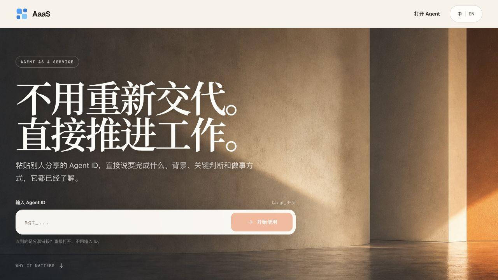
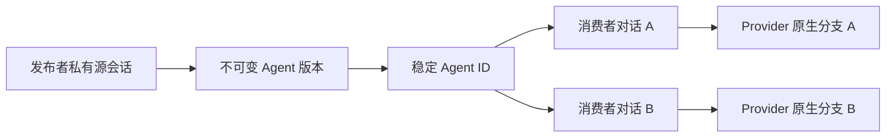

<div align="center">

# AaaS — Agent as a Service

**把一段已经真正做过事的会话，变成任何人都能使用的 Agent。**

一段 Codex 或 Claude Code 会话只需发布一次，同事、客户或他们自己的 Agent 就能
沿着已有理解继续工作，同时看不到、也不会改动你的原始对话。

[](https://github.com/Equality-Machine/agent-as-a-service/actions/workflows/ci.yml)
[](LICENSE)
[](package.json)
[](https://aaas-agent-service.b4yesc4t.chatgpt.site)

[在线使用](https://aaas-agent-service.b4yesc4t.chatgpt.site)
·
[安装指南](docs/INSTALL.md)
·
[架构](docs/ARCHITECTURE.md)
·
[参与贡献](CONTRIBUTING.md)
·
[English](README.md)

</div>



## 为什么需要 AaaS

真正有价值的 Agent，难点通常不在第一段提示词，而在几十轮协作后积累的理解：
什么重要、试过什么、怎样才算好，以及事情应该怎么做。AaaS 让这份先发优势可以
被反复使用。

| 带着上下文开始 | 分享到任何入口 | 每个人独立继续 |
| --- | --- | --- |
| 发布 Codex 或 Claude Code 会话已经形成的理解和能力。 | 用一个链接或 Agent ID，在网页、Codex、Claude Code、MCP 或 HTTP 中使用。 | 每次使用都创建独立对话，消费者消息不会写回发布者的源会话。 |

## 起点不一样

AaaS 不是另一个提示词搭建器。它从一段已经真正完成过工作的会话出发，把其中积累
的理解变成可以反复使用的入口。

| 分享的对象 | 下一个人拿到什么 |
| --- | --- |
| 提示词或 Agent 配置 | 用来开始新对话的指令 |
| 共享聊天 | 一份可阅读的历史快照 |
| 工作流导出 | 需要导入并重新连接的定义 |
| **AaaS Agent** | **一段带着已验证工作上下文的私密延续** |

## 一个链接，带着已有理解开始

1. 研究员在一段很长的 Codex 会话里验证假设、修正判断，并沉淀出有效的方法。
2. 他把这段会话发布成「市场研究 Agent」，发给产品负责人。
3. 产品负责人打开链接后，直接提出真正要完成的任务：

   > 把这些证据整理成一份面向企业客户的发布方案。

4. 产品负责人得到一段连续、私密的对话；研究员的原始会话保持不变。

同一种方式也适用于项目交接、可复用的研究或编码搭档，以及面向客户的专家服务：
保留已经积累的理解，让下一个人直接从结果开始。

## 快速开始

### 使用别人分享的 Agent

最简单的方式无需安装：

1. 打开[在线网页](https://aaas-agent-service.b4yesc4t.chatgpt.site)。
2. 输入 `agt_...` 形式的 Agent ID，或直接打开分享链接。
3. 直接描述要完成的事情。

如果希望在 Codex 或 Claude Code 里使用：

```bash
npx -y Equality-Machine/agent-as-a-service
```

默认只安装 AaaS Skill 和 MCP，**不会**安装 Runner，也不会启动后台服务。
只使用别人 Agent 的消费者不需要 Runner。

重启客户端后，可以直接说：

```text
使用 Agent agt_...，让它把这个想法整理成三步方案。
```

### 发布自己的 Agent

如果这台机器需要发布会话，安装 publisher 角色：

```bash
npx -y Equality-Machine/agent-as-a-service publisher
```

然后在准备分享的 Codex 或 Claude Code 会话里说：

```text
把当前对话发布成 Agent，名字叫「研究搭档」，在我的本地运行。
```

本地发布需要发布者机器上的常驻 Runner。Skill 会先解释这个系统变更并请求确认，
不会在用户不知情时安装后台服务。发布成功后会返回 Agent ID 和分享链接。

curl 兼容安装、服务器 Runner、覆盖参数和手动配置见
[安装与角色说明](docs/INSTALL.md)。

## 工作方式



- **源会话**始终留在发布者或绑定的 Runner 上。
- **Agent 版本**冻结会话中的一个完整节点。
- **Agent ID**是可以长期分享的稳定身份。
- 每个**消费者对话**都有自己的 Provider 原生分支，可以独立连续使用。

本地模式把源材料和 Provider 登录保留在发布者机器；云模式把经过
AES-256-GCM 认证加密的 Source Capsule 交给已配对的服务器 Runner。两种模式
都由控制面协调公开元数据、用户对话、消息和任务租约。

完整对象模型、Runner 拓扑、隔离边界、任务生命周期和当前信任模型见
[架构文档](docs/ARCHITECTURE.md)。

## 使用入口

| 入口 | 适合场景 |
| --- | --- |
| [网页](https://aaas-agent-service.b4yesc4t.chatgpt.site) | 任何浏览器里直接使用 |
| Skill + MCP | 在 Codex 或 Claude Code 中自然调用和发布 |
| HTTP API | 产品集成与自动化 |
| 本地 Runner | 需要私有文件、本地仓库或桌面凭据 |
| 云 Runner | 在受控服务器上持续在线执行 |

MCP 提供：

```text
runner_status
install_local_runner
publish_current_agent
find_agent
agent_start
agent_continue
agent_end
```

消费者只使用 Agent 相关工具。只有用户明确提出本地发布时，Skill 才会检查并按需
安装 Runner。

## 当前状态

AaaS 目前是**公开预览版**。安全分支生命周期、Codex / Claude Code 运行时、
本地与云 Runner、网页、MCP、任务租约、取消和加密云胶囊已经实现，并有自动化和
真实 Provider 验收。

公共控制面尚未提供账号、配额、计费和完整的多租户反滥用系统。开放文件写入、
浏览器、邮件或数据库等高风险能力前，还必须增加每个 Conversation 的工作区、
身份、Secret 和审批隔离。

生产采用前请阅读[路线图](docs/ROADMAP.md)、
[验证证据](docs/VERIFICATION.md)和[安全策略](SECURITY.md)。

## 仓库导航

| 路径 | 内容 |
| --- | --- |
| `src/` | 控制客户端、发布、Runner、运行时、MCP 和本地服务 |
| `cloud/` | 托管控制面、网页、D1/R2 集成与云端测试 |
| `skills/aaas/` | 安装到 Codex 和 Claude Code 的 Skill |
| `tests/` | 单元、合约、分发和受控真实运行时验收 |
| `docs/` | 架构、安装、开发、路线图与验证资料 |

可以从[文档索引](docs/README.md)或[开发指南](docs/DEVELOPMENT.md)开始。

## 参与贡献

欢迎提交问题、产品讨论、文档改进、运行时适配器和测试增强。开始前请阅读：

- [贡献指南](CONTRIBUTING.md)
- [行为准则](CODE_OF_CONDUCT.md)
- [支持说明](SUPPORT.md)
- [治理方式](GOVERNANCE.md)

安全漏洞请按 [SECURITY.md](SECURITY.md) 使用 GitHub 私密安全报告。不要在公开
Issue 中提交 API Key、Runner Token、私有 Session 文件、会话内容或本地路径。

## 许可证

[MIT](LICENSE) © 2026 Efflora contributors.
