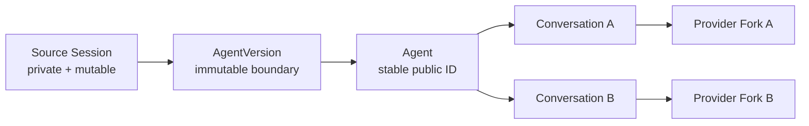
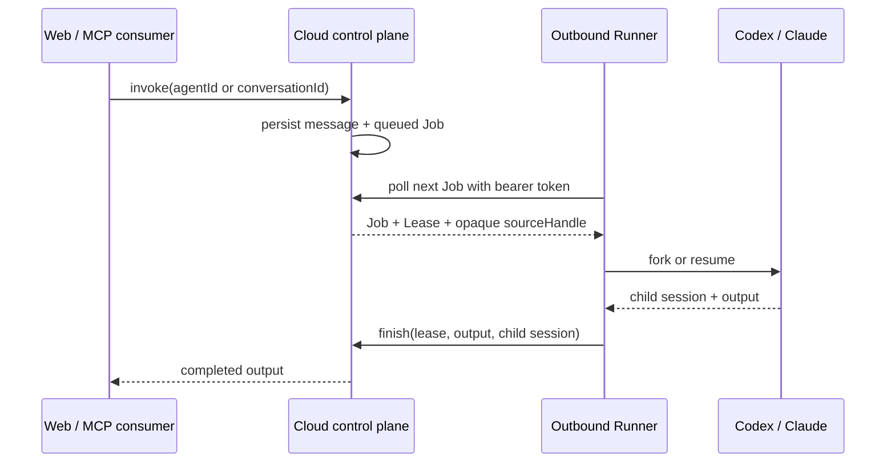

# AaaS 架构

## 产品边界

Source Session、Agent、AgentVersion 和 Conversation 是四个不同对象：

- Source Session 属于发布者，继续对话不会改变已发布版本。
- Agent 是 `agt_...` 的稳定公共身份。
- AgentVersion 是 `ver_...` 的冻结发布边界。
- 每次 `agent_start` 创建新的 `cnv_...`；该 Conversation 内的后续消息只
  resume 它自己的 Provider child session。

## 控制面

生产控制面运行在 Sites + Cloudflare：

- D1：Agent、Runner token hash、Conversation、Message、Job/Lease。
- R2：仅 cloud 模式使用的加密 Source Capsule。
- Next/Vinext UI：按 Agent ID 查找、创建/继续/结束 Conversation。
- API：publish、lookup、invoke、job polling、runner claim/result、capsule fetch。

公共 API 不返回 source path、publisher Session ID、Runner token 或 Provider
child session ID。

## 发布边界

### Codex

1. 通过 `CODEX_THREAD_ID` 找到当前 JSONL。
2. 复制为权限 `0600` 的私有 snapshot。
3. 保存当前 `turn_context.turn_id` 为 `beforeTurnId`，因此发布工具所在的进行中
   Turn 不会进入版本。
4. 首次消费调用 app-server `thread/fork(path, beforeTurnId)`。
5. Fork 后调用 `thread/goal/clear`，只继承上下文，不继承发布者 active Goal。
6. 后续调用 `thread/resume(childId)`。

### Claude Code

1. 复制 JSONL，并截断到最后一个带 `stop_reason` 的完整 assistant turn。
2. 分配独立 template session ID。
3. Runner 把冻结 JSONL materialize 到 Claude projects store，并把
   `sessionId` 重写为 template ID。
4. 首轮 `--resume template --fork-session`，后续只 resume child ID。

这避免 Claude CLI 因只能按 Session ID resume 而回读持续增长的发布者文件。

## Job / Lease

Runner 只发起出站 HTTPS，不需要 NAT 穿透。D1 的条件更新确保同一 queued Job
只有一个有效 Lease。

## 本地与云 Runner

### Local Runner

Source Snapshot、Provider 凭据和工作区留在发布者机器。控制面根据
`sourceHandle` 把 Job 发给该机器。适合依赖 Keychain、本地仓库、桌面应用和
私有文件的 Agent；机器离线时 Agent 变为暂时不可用。

### Cloud Runner

服务器先生成 Runner ID/token。发布者使用 token 派生 AES-256-GCM 密钥，
压缩并加密 Snapshot；R2 只保存 ciphertext。Runner 首次看到 sourceHandle 时
下载、认证解密并验证 AgentVersion digest，然后在服务器 materialize Source。

Cloud Runner 必须重新绑定 Provider 登录态、代码、Secrets 和工具依赖。会话文本
不能自动携带这些环境能力。

当前加密保护静态 R2 内容和非 Runner 调用者；token 经 TLS 到达可信控制面并只
持久化 hash。若控制面也不可信，应升级为 Runner 非对称公钥包裹每个 Capsule
的数据密钥。

## 权限与副作用

默认：

- Codex：read-only sandbox、network disabled、approval never。
- Claude：`Read,Grep,Glob`。
- Snapshot 和 Runner state：`0600`。
- Source digest 在每次首次导入、调用前后检查。

这些保证对话历史不写回，但不自动隔离邮件、数据库、浏览器或文件写入。开放有
副作用的工具前，需要：

- 每 Conversation 的 worktree/container；
- 每用户 principal、tenant scope、ACL、quota；
- 独立 secret grant 和高风险审批；
- heartbeat、lease expiry、cancel、幂等 turn ID；
- 审计、限流、内容与成本策略。

## 现阶段信任模型

功能验收版信任 Sites 控制面和 Runner 主机。公共发布/调用未接账号、计费与反滥用
系统。它已经实现了会话隔离和两种 Runner 拓扑，但不是可直接承载开放互联网大规模
不受信任流量的最终多租户产品。
