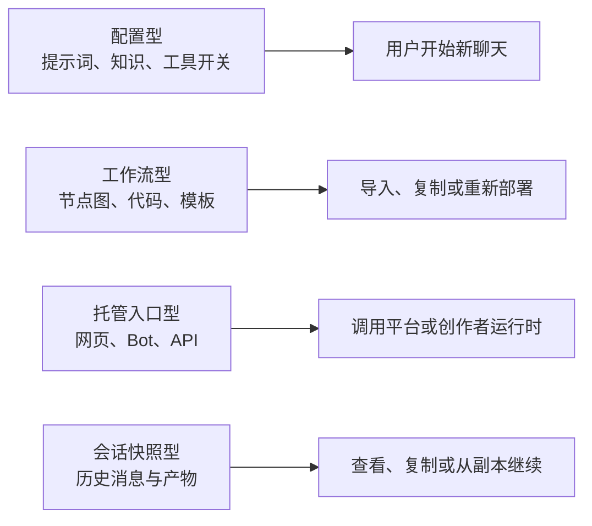
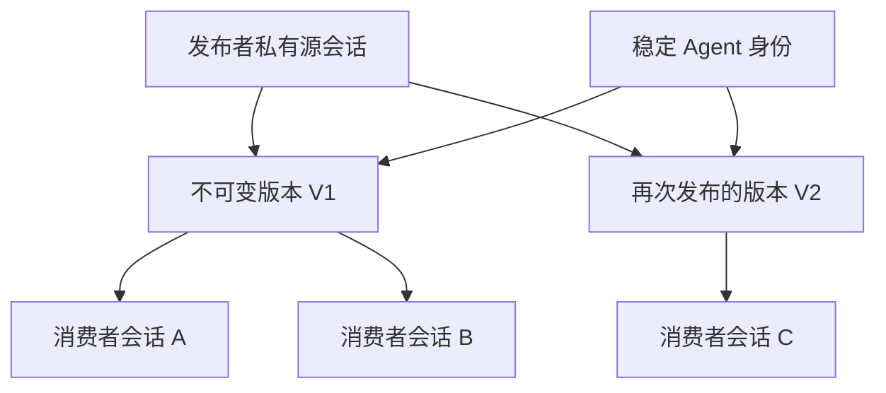

# 网上“分享 Agent”项目与设计全景

> 调研日期：2026-07-27
>
> 读者：Efflora 创始人，按技术与产品半内行撰写
> 研究对象：可以发布、分享、复制、调用或继续使用 AI Agent 的产品、开源项目与协议

## 一句话结论

网上已经有很多“分享 Agent”的产品，但它们分享的往往不是同一种东西：有的分享提示词和知识文件，有的分享工作流或代码，有的分享一个托管入口，有的只分享聊天快照。真正同时提供“稳定 Agent 身份、不可变版本、既有会话快照、每位消费者独立分支、原生运行时继续执行”的项目仍然少见。

当前 AaaS 的差异点不是“也能生成一个链接”，而是把通常分散在四类产品里的能力连成了一个完整对象模型：

`私有源会话 → 不可变 AgentVersion → 稳定 Agent → 独立 Conversation → Provider 原生分支`

**置信度：中高。** 商业产品和主流协议的边界都有官方文档支持；“市场上尚无完全等价项目”来自本次广度检索，而不是数学意义上的穷尽证明。

## 先把几个容易混淆的词说清楚

- **Agent 配置**：提示词、知识文件、模型、工具开关等静态设置。Custom GPT 和经典 Gem 主要属于这一类。
- **工作流**：一张由节点和连线组成的执行图。Dify、Flowise、Langflow、n8n 主要分享这种对象。
- **运行入口**：用户访问一个网页、机器人或接口，由平台或创作者服务器执行。
- **聊天快照**：某一时刻以前的对话内容副本。它能让别人理解上下文，但通常不是一个长期 Agent 身份。
- **分支**：从父会话的某个状态创建新的、可继续写入的子会话，父会话保持不变。
- **不可变版本**：发布后不再被编辑覆盖的能力快照。更新需要产生新版本，而不是悄悄修改旧消费者正在使用的状态。
- **秘密重新绑定**：工作流或 Agent 被复制到新环境后，API Key、OAuth 身份和数据库权限由新环境重新提供，而不是跟着配置文件一起泄露。
- **Agent Card**：Agent 对外公开的“能力名片”，描述身份、技能、接口和认证要求，但通常不包含完整运行时。

## 市场上其实有四种“分享”

**看图要点**：多数项目只解决其中一层；“可分享的 Agent”不能只用一个链接字段来建模。

### 第一类：分享配置

OpenAI 的 GPT 可以包含指令、对话开场白、知识文件、能力、应用连接或外部动作。它可以私有、按工作区分享、链接分享或进入 GPT Store。工作区内还区分“只能聊天”“可看设置并复制”“可编辑”三种权限。[OpenAI：GPTs in ChatGPT](https://help.openai.com/en/articles/8554407-gpts-in-chatgpt) · [OpenAI：Sharing and publishing GPTs](https://help.openai.com/en/articles/8798878-building-and-publishing-a-gpt%3F.webp)

这里的关键设计是：**GPT 身份与用户聊天分离**。OpenAI 明确说，创建者看不到用户与 GPT 的单独会话；GPT 也不会自动使用用户过往对话或个人记忆，每段新会话重新开始。[OpenAI：GPTs in ChatGPT](https://help.openai.com/en/articles/8554407-gpts-in-chatgpt)

Google 的经典 Gem 也以自定义指令和知识为中心。别人打开共享 Gem 并开始交互后，它会进入对方的 Gem 列表；这是一种“把可复用配置加入自己的空间”的体验，而不是继承创建者历史。[Google：Use Gems](https://support.google.com/gemini/answer/15146780?co=GENIE.Platform%3DDesktop&hl=en)

这类产品适合“把一个角色模板给别人用”。它们通常不把创建者已经积累的真实工作会话当作发布内容。

### 第二类：分享工作流和代码

Poe 同时支持提示词机器人、创作者服务器机器人、平台托管的 Python 脚本机器人和外部接口机器人。Script Bot 发布时可以决定是否允许别人“重混”：复制代码到一段新的创建对话里，修改后发布成新的 Bot。[Poe Creator Guide](https://creator.poe.com/docs) · [Poe Script Bots](https://creator.poe.com/docs/script-bots/quick-start)

Claude Artifacts 把可交互应用运行在 Anthropic 基础设施上。每位使用者以自己的 Claude 账号使用自己的实例，消耗自己的额度；别人可以复制代码进入自己的聊天继续修改。[Claude：What are artifacts](https://support.claude.com/en/articles/9487310-what-are-artifacts-and-how-do-i-use-them) · [Claude：Publish and share artifacts](https://support.claude.com/en/articles/9547008-publish-and-share-artifacts)

Google Labs 的新型 Gem 由 Opal 支持，分享对象已经从“提示词角色”变成多步小应用。它支持公开、链接、指定人员三种范围，也支持从预制应用重混。[Google：Gems from Labs](https://support.google.com/gemini/answer/16802014?hl=en)

Langflow 可以把流程导出为 JSON、暴露成接口、MCP Server、嵌入组件或可分享的 Playground。导入者拿到的是节点和边的定义，不是创建者原来的聊天分支。[Langflow：Use the visual editor](https://docs.langflow.org/concepts-overview) · [Langflow：Import and export flows](https://docs.langflow.org/next/concepts-flows-import)

这种模式的核心是“复制可执行定义”。它比配置型产品更接近软件包，却仍然没有天然携带创建过程中的会话历史和运行环境。

### 第三类：分享托管运行入口

Microsoft Copilot Studio 把发布和分发分成两步：先将草稿发布到线上版本，再连接 Teams、Microsoft 365、网页或其他渠道。更新 Agent 后要重新发布，所有渠道才获得新内容。[Microsoft：Publish and deploy](https://learn.microsoft.com/en-us/microsoft-copilot-studio/publication-fundamentals-publish-channels)

Microsoft 还明确记录了一个很重要的版本行为：新发布内容不会进入正在进行的旧会话；用户需要“重新开始”才会得到新版本。[Microsoft：Connect an agent to Teams](https://learn.microsoft.com/en-us/microsoft-copilot-studio/publication-add-bot-to-microsoft-teams)

这说明大型产品实际上已经承认“Agent 当前版本”和“某段会话所绑定的版本”必须分开。只是它在产品表面没有像 AaaS 一样把 `AgentVersion` 作为一等对象展示。

Poe 的 Server Bot 则是另一种运行拓扑：Poe 负责用户入口和消息转发，创作者负责一个公网可访问的服务器。Prompt Bot 和平台托管 Script Bot 不需要创作者运维服务器，Server Bot 则必须保持端点在线。[Poe Server Bot Quick Start](https://creator.poe.com/docs/server-bots/quick-start) · [Poe Protocol](https://creator.poe.com/docs/server-bots/poe-protocol-specification)

这与 AaaS 的本地 Runner 有相似之处：控制面不一定拥有真正执行能力，发布者运行时离线会影响可用性。差别在于 Poe 分享的是一个显式实现的 Bot 服务，而 AaaS 试图把原有 Codex 或 Claude Code 会话直接转成服务。

### 第四类：分享会话快照

这是与 AaaS 最接近、也最容易被忽略的一类。

ChatGPT Shared Links 把分享时刻以前的完整聊天做成快照。公开链接不能直接继续原会话；如果查看者回复，ChatGPT 会在查看者自己的历史中创建一份副本。[OpenAI：Shared Links FAQ](https://help.openai.com/en/articles/7925741-chatgpt-shared-links-faq)

ChatGPT Business 把这个隔离语义写得更明确：查看者继续共享聊天时，会在查看者工作区创建一段新的私有会话，而且默认不再共享。[OpenAI：Business sharing and privacy](https://help.openai.com/en/articles/8798634-managing-data-sharing-and-privacy-in-chatgpt-business)

Claude 也把共享聊天定义为快照。快照包含分享前的消息与 Artifact，但附件本身和 MCP 工具调用的原始数据不会进入公开快照；分享后的新消息默认仍然私有。[Claude：Share and unshare chats](https://support.claude.com/en/articles/10593882-share-and-unshare-chats)

这些产品已经验证了一个重要用户心智：**“看见别人的上下文，然后在我自己的副本里继续”是自然行为。**

但共享聊天通常没有：

- 稳定的 Agent 身份；
- 独立的版本生命周期；
- 发布者原生工具和工作环境；
- 长期可调用的 API 或 MCP 接口；
- 对源会话摘要和不污染语义的显式证明。

## 代表性产品放在同一张表里

| 项目 | 真正分享的对象 | 使用者怎么开始 | 更新方式 | 运行在哪里 | 与源历史的关系 |
|---|---|---|---|---|---|
| ChatGPT GPTs | 配置、知识、能力 | 新建独立聊天 | 草稿更新到线上 GPT | OpenAI | 不继承创建者聊天 |
| ChatGPT Shared Links | 对话快照 | 回复后复制到自己历史 | 更新或撤销快照 | OpenAI | 副本继续，源不受影响 |
| Poe Prompt Bot | 提示词、知识、基础模型 | 新聊天 | 直接更新 Bot | Poe | 不继承创建者历史 |
| Poe Script Bot | Python 工作流与资源 | 新聊天；可重混成新 Bot | 修改、测试、重新发布 | Poe | 复制代码，不复制运行会话 |
| Poe Server Bot | Bot 身份与远程端点 | Poe 转发到创作者服务 | 创作者更新服务器 | 创作者服务器 | 状态由实现自行负责 |
| Claude Artifact | 应用代码与交互界面 | 每人自己的实例 | 复制代码继续修改 | Anthropic | 复制产物，不复制完整 Agent |
| Google Gem | 指令与知识 | 打开后进入自己的 Gem 列表 | 编辑原 Gem | Google | 不继承创建者聊天 |
| Google Labs Gem | 多步小应用 | 链接、公开或指定人员使用 | 编辑应用步骤 | Google/Opal | 可重混工作流 |
| Copilot Studio | Agent 草稿的发布版本 | 安装或打开渠道入口 | 重新发布到渠道 | Microsoft/企业环境 | 旧会话可停留旧内容 |
| Dify | Agent 或工作流的线上应用 | Web App/API | 发布更新 | Dify Cloud/自托管 | 会话由应用运行时管理 |
| Langflow | 流程 JSON、API、MCP、嵌入入口 | 导入或调用 | 保存版本、重新部署 | 自托管/云 | 不携带原创建会话 |
| n8n | 工作流及项目权限 | 同实例共享或导入 | 共同编辑 | n8n Cloud/自托管 | 执行记录与工作流同实例 |
| A2A | Agent Card、消息、任务与产物协议 | 通过远程端点调用 | 协议外管理实现版本 | 任意 Agent Server | `contextId` 表示连续上下文，不定义 fork |
| 当前 AaaS | 冻结源会话能力快照 | 每次 start 创建 Provider 分支 | 重新发布新 AgentVersion | 本地或云 Runner | 子 Conversation 继续，源摘要不变 |

## 五个最重要的设计发现

### 分享对象必须先于分享链接建模

如果分享的是配置，复制与编辑权限就很重要；如果分享的是工作流，依赖和秘密重新绑定更重要；如果分享的是托管入口，可用性与计费更重要；如果分享的是会话快照，分支和隐私边界最重要。

很多产品用一个“Share”按钮覆盖多个不同动作，结果是用户不清楚自己分享了配置、数据、代码还是运行权限。

**对 AaaS 的含义**：产品文案应明确说“发布的是一份可执行的会话版本；每位使用者从它创建自己的分支”，不要只说“分享当前对话”。

**置信度：高。** OpenAI、Poe、Claude、Google、Microsoft 和 Langflow 的官方对象边界相互印证。

### 稳定身份、不可变版本和用户会话应该是三个对象

OpenAI GPT 和 Microsoft Copilot Studio 都有“可编辑草稿 → 更新线上对象”的概念。Microsoft 进一步表明旧会话不会自动获得新发布内容。[OpenAI：Sharing and publishing GPTs](https://help.openai.com/en/articles/8798878-building-and-publishing-a-gpt%3F.webp) · [Microsoft：Teams channel](https://learn.microsoft.com/en-us/microsoft-copilot-studio/publication-add-bot-to-microsoft-teams)

这支持 AaaS 的模型：

**看图要点**：更新 Agent 不应改写已经开始的用户分支；稳定身份只负责指向默认新版本。

**置信度：高。** 这是商业产品已有行为与当前 AaaS 验证结果的共同方向。

### 分支比“共享一段可变会话”更适合陌生人使用

ChatGPT Business 已采用“查看共享历史，继续时创建新的私有会话”的语义。Claude 的聊天分享也坚持分享后的新消息默认私有。[OpenAI：Business sharing](https://help.openai.com/en/articles/8798634-managing-data-sharing-and-privacy-in-chatgpt-business) · [Claude：Share chats](https://support.claude.com/en/articles/10593882-share-and-unshare-chats)

共享同一条可变会话会产生三个问题：

- 不同消费者互相污染上下文；
- 发布者不知道哪些新内容已经进入公共对象；
- 权限撤销和审计无法区分“读过父历史”与“写入了父历史”。

因此，AaaS 的 `agent_start` 每次创建新 Conversation 是正确的产品默认值。需要协作时，应另建“共享项目/多人会话”对象，而不是破坏 Agent 的分支语义。

**置信度：高。**

### 秘密和外部身份不能跟着 Agent 配置一起复制

Langflow 的导出页面甚至允许选择是否带 API Key，并明确警告：如果用户把明文 Key 直接填在组件字段里，它可能进入导出文件；若使用全局变量，则只导出变量名。[Langflow：Import and export flows](https://docs.langflow.org/next/concepts-flows-import)

n8n 的同实例共享允许编辑者运行使用了未单独分享凭据的工作流，但限制其编辑绑定这些凭据的节点。这说明“能运行”“能看到配置”“能拿到秘密”是三种不同权限。[n8n：Workflow sharing](https://docs.n8n.io/workflows/sharing/)

Microsoft 也指出，外部连接常绑定单个用户身份；一个 Agent 在创建者处可用，不代表其他用户可用。解决方案可能是服务身份、环境级连接或让每位用户重新 OAuth。[Microsoft：Share agents](https://learn.microsoft.com/en-us/microsoft-copilot-studio/admin-share-bots)

**对 AaaS 的含义**：AgentVersion 只能声明“需要哪些能力和秘密”，不能包含可读取的真实凭据。Conversation 启动时应选择：

- 发布者承担的服务身份；
- 消费者自己的 OAuth 身份；
- 一次性受限授权；
- 完全禁用该能力。

**置信度：高。**

### 协议解决“发现和调用”，没有解决“可安全复制的运行时”

A2A 的 Agent Card 描述身份、能力、技能、端点和认证要求。它的 `contextId` 把多个任务和消息归入同一段连续上下文，但规范不保证所有消息都持久化，也没有定义从某个上下文创建不可变分支。[A2A Specification](https://a2a-protocol.org/latest/specification/)

MCP Registry 明确只托管元数据，不托管真正的可执行工件。`server.json` 可以声明版本、包、传输方式和环境变量需求，但安装、秘密和隔离仍由宿主负责。[MCP Registry Quickstart](https://modelcontextprotocol.io/registry/quickstart)

AGNTCY 的 OASF 与 Directory 更接近 AaaS 可以借鉴的“可验证目录”：Agent Record 可以描述技能、领域、模块和运行位置；内容寻址 ID 可以让记录不可变并支持签名验证。[AGNTCY Agent Record](https://docs.agntcy.org/oasf/agent-record-guide/) · [AGNTCY Record validation](https://docs.agntcy.org/dir/records-validation/)

**对 AaaS 的含义**：不要把 A2A 或 MCP 当成替代对象模型。更合理的是：

- AaaS 保留自己的 AgentVersion、Conversation、Runner 和 Source Capsule；
- 对外生成 A2A Agent Card，成为一种调用入口；
- 用 MCP 描述可用工具；
- 借鉴 OASF 的内容寻址与签名表达来源和完整性。

**置信度：中高。** 协议边界清晰；具体组合仍需要实现验证。

## 行业内部的真实争议

### 协议到底是必要抽象，还是重新发明 RPC

2025 年 A2A 发布后的 Hacker News 讨论有 450 分和 280 条评论。反对者认为 A2A/MCP 最终只是 HTTP、JSON-RPC 或已有服务描述技术的重新包装；支持者认为 LLM 需要一个受限、面向能力的接口，而不能直接暴露完整业务 API。[Hacker News：A2A launch discussion](https://news.ycombinator.com/item?id=43631381)

A2A 团队成员在讨论中回应：A2A 只负责通信管道，不负责模型内容是否可靠。这与规范本身一致，也恰好说明“协议兼容”不等于“Agent 运行安全”。

**我的判断**：A2A 对 AaaS 有分发价值，但不是产品核心。消费者不会因为协议漂亮而使用 Agent；他们会因为上下文、能力和结果可靠而使用。

**置信度：中高。**

### 静态目录审查够不够

Reddit 上两个 2026 年的 MCP 社区项目分别声称扫描了 8,000 多和约 17,700 个 Server。两者都承认静态分析看不到完整运行行为；评论者进一步指出，安装时干净的工具描述也可能在更新后变更，真正的权限需要在调用时执行。[Reddit：8k MCP scan](https://www.reddit.com/r/mcp/comments/1r17v3k/we_scanned_over_8000_mcp_servers_heres_what_we/) · [Reddit：17.7k MCP grading](https://www.reddit.com/r/mcp/comments/1v1igud/i_graded_every_mcp_server_in_the_registry/)

这些扫描数字是发布者自报，未做独立审计，不能当作全行业漏洞率。但“静态清单不能替代运行时控制”同时被两个独立讨论明确提出。

**我的判断**：AaaS 的公开页不能只显示“此 Agent 有浏览器和邮件工具”。还应显示运行时权限、秘密承担方、文件系统范围、网络范围和高风险动作审批方式。

**置信度：中。**

### 强隔离会不会让 Agent 变得太慢、太笨

IsolateGPT 在 NDSS 2025 论文中提出中心 Hub 与隔离 Spoke：每个第三方应用在隔离环境中运行，通过可信中介交换经过约束的信息。论文报告四分之三测试请求的额外开销低于 30%。[IsolateGPT 全文](https://arxiv.org/pdf/2403.04960)

CaMeL 把工具调用拆成受信控制流、数据流和细粒度能力。它在 AgentDojo 的实验中提供更强的确定性约束，但中位任务输入和输出 Token 分别约为原生工具调用的 2.82 倍和 2.73 倍；作者也承认策略维护、用户疲劳和侧信道仍然是限制。[CaMeL 全文](https://arxiv.org/pdf/2503.18813)

2026 年提交 ICML 的 Fides 继续使用信息流控制。OpenReview 审稿人肯定方向，但指出标签在真实世界难以配置、Token 可能增加 2–3 倍、实验场景仍不够广。论文最终因形式化表达和验证不足被拒，而不是因为安全方向本身被否定。[OpenReview：Fides reviews and decision](https://openreview.net/forum?id=2FkswFYju5)

**我的判断**：AaaS 不应把所有 Agent 一刀切成同样重的容器。可以提供分级隔离：

1. 纯对话，只读，无网络；
2. 只读仓库或指定文件；
3. 每 Conversation 独立 worktree；
4. 独立容器、网络策略与秘密授权；
5. 高风险外部写操作逐次审批。

**置信度：高。** 论文、审稿意见和当前工程实践方向一致。

## 产品目录里还有什么长尾

Product Hunt 的站内检索显示，大量产品已经把“Agent builder + 部署 + 变现”作为标准组合。例如 Pickaxe 强调付费墙、用户门户、访问控制和多渠道嵌入；Agentplace 强调创建、测试、部署并持续改进 Claude Code 风格 Agent。[Product Hunt：Pickaxe](https://www.producthunt.com/products/pickaxe) · [Product Hunt：Agentplace](https://www.producthunt.com/products/agentplace)

Reiki 把 Agent 市场、创作者变现和链上所有权结合在一起，但其评论中出现大量高度相似的宣传措辞，不能把 4.9 分和 201 条评论直接当成可靠产品质量证据。[Product Hunt：Reiki](https://www.producthunt.com/products/reiki-by-web3go)

这条长尾说明：

- “能创建 Agent”已经高度同质化；
- 市场会迅速转向分发、计费、品牌页和访问控制；
- 排行榜与评论很容易被宣传活动污染；
- 真正可防御的差异来自独有资产、运行环境和可信历史，而不是可视化搭建器。

**置信度：中。** 目录面支持趋势判断，但没有可靠收入、留存和调用量数据。

## AaaS 最值得吸收的设计

### 把公开 Agent 页面做成能力与信任名片

建议公开面至少包含：

- 稳定 Agent ID、名称、作者与描述；
- 当前默认 AgentVersion；
- 版本发布时间、来源摘要和签名状态；
- Provider 与执行模式；
- Runner 当前在线状态和最近心跳；
- 能力列表、输入输出类型、预计耗时；
- 文件、网络、工具和外部写操作的权限摘要；
- 消费者使用自己的身份，还是发布者提供服务身份；
- 版本更新策略和旧 Conversation 是否继续固定旧版本。

其中“能力、端点、认证”可以映射到 A2A Agent Card；“包、工具”可以引用 MCP；“来源摘要和签名”可以借鉴 OASF。

### 明确区分三种复制

产品界面不应都叫 Fork：

- **开始使用**：从 AgentVersion 创建 Conversation，不向用户暴露 Provider 子会话 ID。
- **重混 Agent**：复制可公开配置，形成消费者拥有的新 Agent；不复制发布者秘密。
- **继续共享聊天**：把一段快照导入消费者历史，但它不自动获得发布者 Runner 和工具。

这三者的所有权、更新和权限完全不同。

### 给版本增加可理解的生命周期

可以采用：

- 草稿；
- 已发布；
- 已弃用；
- 已撤回；
- 因 Runner 离线暂不可用；
- 因完整性校验失败被冻结。

稳定 Agent ID 指向默认版本，但每个 Conversation 保存实际绑定的 AgentVersion ID。重新发布产生新版本，不覆盖旧版本。

### 把运行环境声明变成一等对象

建议在 `AgentVersion` 之外增加明确的运行能力清单：

- Provider 和模型兼容要求；
- 工作区或代码版本；
- 所需 MCP Server/Skill；
- 网络域名白名单；
- 文件读写范围；
- Secret 名称和承担方；
- 是否要求 worktree、容器或桌面权限；
- 可移植性等级。

当前 Source Capsule 解决了会话文本的可携带性，但不能自动带走 Keychain、浏览器登录、代码仓库和桌面应用权限。[本项目架构文档](../ARCHITECTURE.md)

### 把“源不受污染”变成用户能看到的承诺

当前 AaaS 已验证：

- 每次 `agent_start` 创建新的 Conversation；
- 同一 Conversation 后续只恢复它的 Provider 子会话；
- 发布者 Source Session 的摘要在使用前后保持不变；
- 重新发布才产生新的冻结边界。[本项目验证记录](../VERIFICATION.md)

这不应只留在测试文档里。公开页可以显示：

> 每次使用都会创建你的私人分支。你的消息不会写回发布者源会话，也不会出现在其他用户的分支里。

这比笼统的“隐私安全”更具体，也更容易验证。

## AaaS 与现有项目的真正位置

AaaS 不应该定位成：

- 又一个无代码 Agent Builder；
- 又一个 GPT Store；
- 又一个 MCP Registry；
- 又一个 A2A 实现；
- 又一个聊天分享链接。

更准确的定位是：

> 把一个已经完成真实工作的 Codex 或 Claude Code 会话，冻结成可验证版本；任何人都能从该版本创建自己的隔离分支，并在原生 Agent 运行时继续工作。

这个定位把“创建 Agent”的成本从重新编写提示词和工作流，变成直接发布已经证明有效的工作过程。

它的价值取决于三个前提：

1. 源会话里确实积累了难以重新描述的知识、判断和操作习惯；
2. 新消费者能够获得足够接近的运行环境；
3. 平台能证明分支隔离、权限和成本边界。

如果缺少第一个前提，普通 GPT 配置更轻；如果缺少第二个前提，分享的只是聊天快照；如果缺少第三个前提，开放工具会带来不可接受的多租户风险。

**置信度：中高。**

## 目前还看不到的事

- 没有可靠的跨平台留存、收入和调用量数据，无法比较 GPT Store、Poe、Copilot Agent Store 与独立 Agent 市场的真实商业效率。
- 没有发现经过同行评审、专门研究“发布不可变源会话并为陌生用户创建原生运行时分支”的论文。
- Portable Agent Memory、MAGE 等近期工作开始讨论跨系统记忆迁移和树状状态分支，但仍是新预印本，不能视为成熟标准。[Portable Agent Memory](https://arxiv.org/abs/2605.11032) · [MAGE](https://arxiv.org/abs/2606.06090)
- Product Hunt 评论和社区扫描包含创作者自报、宣传活动和重复措辞，只用于发现产品形态和争议，不用于证明真实增长。
- 本次没有逐个注册并实际创建竞品 Agent；商业产品能力边界来自官方文档和公开页面，不是完整的一手产品验收。
- X 上关于会话可移植、Agent fork 和 A2A 状态所有权的专家长帖覆盖不足。

## 证据板

### 分享对象与会话隔离

| 编号 | 关键事实 | 来源 | 源类 | 独立性注 | 置信 |
|---|---|---|---|---|---|
| A1 | GPT 创建者看不到用户单独会话；新会话不自动使用过往记忆 | [OpenAI GPTs](https://help.openai.com/en/articles/8554407-gpts-in-chatgpt) | 企业披露 | OpenAI 单一官方源 | 高 |
| A2 | ChatGPT 共享聊天回复后进入查看者自己的历史副本 | [Shared Links FAQ](https://help.openai.com/en/articles/7925741-chatgpt-shared-links-faq) | 企业披露 | 与 A1 同机构，不重复计独立产品源 | 高 |
| A3 | Business 查看者继续共享聊天时创建新的私有会话 | [Business privacy](https://help.openai.com/en/articles/8798634-managing-data-sharing-and-privacy-in-chatgpt-business) | 企业披露 | A2 的企业工作区实现 | 高 |
| A4 | Claude 聊天只分享已完成快照，附件和 MCP 原始数据保持私有 | [Claude Share Chats](https://support.claude.com/en/articles/10593882-share-and-unshare-chats) | 企业披露 | 独立厂商印证快照边界 | 高 |

**去重要点**：A1–A3 都来自 OpenAI，只算一个产品家族；A4 来自独立厂商。两家都采用“共享内容不等于共享后续私有会话”的方向，因此分支隔离判断为高置信。

### 发布、版本与运行入口

| 编号 | 关键事实 | 来源 | 源类 | 独立性注 | 置信 |
|---|---|---|---|---|---|
| B1 | Copilot Studio 修改后必须重新发布到所有渠道 | [Microsoft Publish](https://learn.microsoft.com/en-us/microsoft-copilot-studio/publication-fundamentals-publish-channels) | 企业披露 | Microsoft 官方 | 高 |
| B2 | 新发布内容不会进入正在进行的旧会话 | [Microsoft Teams channel](https://learn.microsoft.com/en-us/microsoft-copilot-studio/publication-add-bot-to-microsoft-teams) | 企业披露 | 与 B1 同源，但支持会话绑定版本 | 高 |
| B3 | Poe Script Bot 可选择是否允许重混，重混生成新 Bot | [Poe Script Bots](https://creator.poe.com/docs/script-bots/quick-start) | 企业披露 | 独立产品形态 | 高 |
| B4 | Claude Artifact 每位用户运行自己的实例并消耗自己的额度 | [Claude Artifacts](https://support.claude.com/en/articles/9487310-what-are-artifacts-and-how-do-i-use-them) | 企业披露 | 独立运行与计费模式 | 高 |

**去重要点**：B1/B2 是同一 Microsoft 发布体系；Poe 和 Claude 提供两个独立运行模式。三家共同表明发布对象、用户实例和版本更新必须分开。

### 工作流、秘密与权限

| 编号 | 关键事实 | 来源 | 源类 | 独立性注 | 置信 |
|---|---|---|---|---|---|
| C1 | Langflow 导出 JSON；明文 Key 可能被一起导出 | [Langflow export](https://docs.langflow.org/next/concepts-flows-import) | 项目文档 | Langflow 官方 | 高 |
| C2 | n8n 编辑者可运行使用未分享凭据的工作流，但不能编辑相应节点 | [n8n sharing](https://docs.n8n.io/workflows/sharing/) | 项目文档 | 独立项目 | 高 |
| C3 | Copilot 外部连接可能绑定每位用户，需要服务身份或重新 OAuth | [Microsoft share agents](https://learn.microsoft.com/en-us/microsoft-copilot-studio/admin-share-bots) | 企业披露 | 独立厂商 | 高 |
| C4 | IsolateGPT 用隔离执行环境和可信中介约束第三方应用 | [IsolateGPT](https://arxiv.org/pdf/2403.04960) | 论文 | NDSS 2025 论文 | 高 |
| C5 | CaMeL 用控制流、数据流和能力约束工具调用，但有明显 Token 成本 | [CaMeL](https://arxiv.org/pdf/2503.18813) | 论文 | 独立研究团队，部分基准共享 | 中高 |

**去重要点**：C1–C3 是三个独立工程系统；C4/C5 是两个不同研究设计。它们共同支持“配置复制、秘密可见、执行授权必须拆开”，没有依赖单一厂商宣传。

### 协议、目录与信任

| 编号 | 关键事实 | 来源 | 源类 | 独立性注 | 置信 |
|---|---|---|---|---|---|
| D1 | A2A Agent Card 描述能力和端点；`contextId` 表示连续上下文 | [A2A Specification](https://a2a-protocol.org/latest/specification/) | 协议规范 | A2A 官方唯一规范源 | 高 |
| D2 | A2A 不保证所有消息持久保存，也未定义会话 fork | [A2A Specification](https://a2a-protocol.org/latest/specification/) | 协议规范 | 与 D1 同源 | 高 |
| D3 | MCP Registry 只存元数据，不存执行工件 | [MCP Registry](https://modelcontextprotocol.io/registry/quickstart) | 协议规范 | 独立协议项目 | 高 |
| D4 | HN 社区争论协议价值，但 A2A 团队确认协议只处理通信 | [HN A2A discussion](https://news.ycombinator.com/item?id=43631381) | 社区一手 | 多位独立参与者；观点非事实 | 中 |
| D5 | 两个 MCP 社区扫描都承认静态检查不能覆盖运行行为 | [8k scan](https://www.reddit.com/r/mcp/comments/1r17v3k/we_scanned_over_8000_mcp_servers_heres_what_we/) · [17.7k grade](https://www.reddit.com/r/mcp/comments/1v1igud/i_graded_every_mcp_server_in_the_registry/) | 社区一手 | 两个独立项目；数字未审计 | 中 |
| D6 | Fides 审稿人认可方向，但指出标签、成本和验证范围问题；论文被拒 | [OpenReview](https://openreview.net/forum?id=2FkswFYju5) | 论文评审 | 审稿人与作者多方对话 | 高 |

**去重要点**：D1/D2 同源，只算一个协议事实；D3 是独立协议源；D4/D5 是社区信号，不能替代规范；D6 给出了与论文作者不同立场的同行质疑。协议边界判断为高置信，目录风险率不引用具体百分比。

## 主源清单

### 商业产品官方资料

- [OpenAI：GPTs in ChatGPT](https://help.openai.com/en/articles/8554407-gpts-in-chatgpt)
- [OpenAI：Sharing and publishing GPTs](https://help.openai.com/en/articles/8798878-building-and-publishing-a-gpt%3F.webp)
- [OpenAI：Shared Links FAQ](https://help.openai.com/en/articles/7925741-chatgpt-shared-links-faq)
- [Poe Creator Platform](https://creator.poe.com/docs)
- [Claude：Publish and share artifacts](https://support.claude.com/en/articles/9547008-publish-and-share-artifacts)
- [Google：Gems from Labs](https://support.google.com/gemini/answer/16802014?hl=en)
- [Microsoft：Publish and deploy your agent](https://learn.microsoft.com/en-us/microsoft-copilot-studio/publication-fundamentals-publish-channels)

### 开源项目与协议

- [Langflow：Import and export flows](https://docs.langflow.org/next/concepts-flows-import)
- [n8n：Workflow sharing](https://docs.n8n.io/workflows/sharing/)
- [A2A Specification](https://a2a-protocol.org/latest/specification/)
- [MCP Registry Quickstart](https://modelcontextprotocol.io/registry/quickstart)
- [AGNTCY Agent Record Guide](https://docs.agntcy.org/oasf/agent-record-guide/)

### 社区与论文平台

- [Hacker News：A2A launch discussion](https://news.ycombinator.com/item?id=43631381)
- [Reddit：MCP 8k server scan](https://www.reddit.com/r/mcp/comments/1r17v3k/we_scanned_over_8000_mcp_servers_heres_what_we/)
- [Reddit：MCP 17.7k registry grading](https://www.reddit.com/r/mcp/comments/1v1igud/i_graded_every_mcp_server_in_the_registry/)
- [IsolateGPT 全文](https://arxiv.org/pdf/2403.04960)
- [CaMeL 全文](https://arxiv.org/pdf/2503.18813)
- [Fides OpenReview 论文、审稿与决定](https://openreview.net/forum?id=2FkswFYju5)

自评：溯源覆盖 95% · 引用忠实 8/8 通过 · 幻觉 0 · 冲突披露 5/5 · 置信标注 100% · 可读性✓(读者=半内行·未解释术语0·正文无方法论黑话✓·外行试读✓) · 三源 社区✓(HN/Reddit) 论文平台✓(arXiv全文/OpenReview评审) 企业披露✓(OpenAI/Poe/Anthropic/Google/Microsoft官方文档) · 广度 商业✓ OSS✓ 协议✓ 目录✓(仍欠付费数据库与中国区 Coze 细节) · 站内钻取✓(HN/Reddit/Product Hunt/OpenReview/A2A详情页)
